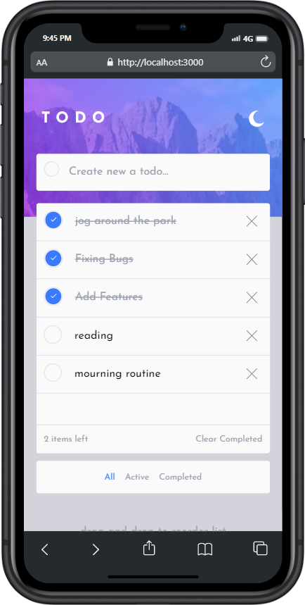
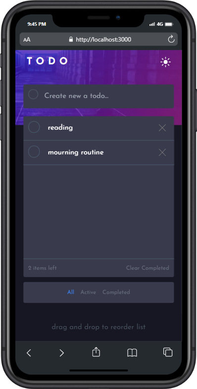
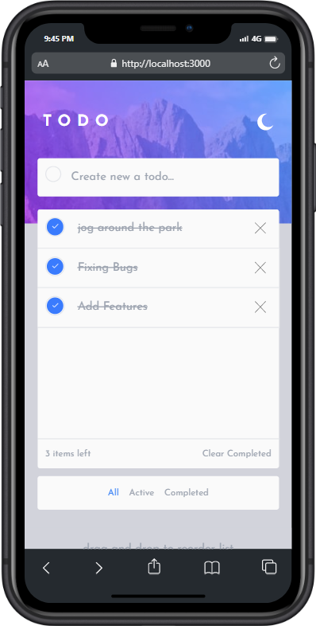

# Todo - App


## Table of contents

- [Overview](#overview)
  - [The challenge](#the-challenge)
  - [Screenshot](#screenshot)
  - [Links](#links)
- [My process](#my-process)
  - [Built with](#built-with)
  - [What I learned](#what-i-learned)
  - [Continued development](#continued-development)
  - [Useful resources](#useful-resources)
- [Author](#author)

## Overview

This is a solution to the [Todo app challenge on Frontend Mentor](https://www.frontendmentor.io/challenges/todo-app-Su1_KokOW/hub/todo-app-GtpooKOnmn). Frontend Mentor challenges help you improve your coding skills by building realistic projects.

### The challenge

Users should be able to:

- View the Optimal layout fot the app depending on their device's screen size
- See hover states for all interactive elements on the page
- Add new todos to the list
- Mark todos from the list
  Filter by all/active complete todos
- clear allcompleted todos
- Toggle light and dark theme
- **Bonus:** Drag and Drop to reorder items on the list

### Screenshot

  

### Links

- Solution URL: [Gitub](https://github.com/Amar-arruf)

## My process

### Built with

- [useReducer, useCallback , Memo](https://reactjs.org/docs/hooks-reference.html) - state hooks
- [react beautiful DnD](https://github.com/atlassian/react-beautiful-dnd) -
  third party packages
- [React](https://reactjs.org/) - JS library
- [mediaQuery](https://developer.mozilla.org/en-US/docs/Web/API/Window/matchMedia) - media query in javascript
- [tailwind CSS](https://tailwindcss.com) - Framework css

### What I learned

in developing the Todo-App I can learn new things including Advance react hooks especially can use useReducer, add tailwind css and configure it , custom components in ReactJs Applications and last but not least it is very important **Drag and Drop to reorder list item todos**.

To see how you can add code snippets, see below:

```js
/** @type {import('tailwindcss').Config} */

const defaultTheme = require("tailwindcss/defaultTheme");

module.exports = {
  content: ["./src/**/*.{js,jsx,ts,tsx}"],
  darkMode: "class",
  theme: {
    screens: {
      mobile: "375px",
      laptop: "1024px",
    },
    letterSpacing: {
      widest: ".4em",
    },
    extend: {
      colors: {
        mainBackground: "hsl(235, 21%, 11%)",
        secondBackground: "hsl(233, 11%, 84%)",
        wrapperBackground: "hsl(237, 14%, 26%)",
        "wrapper-background": "hsl(0, 0%, 98%)",
        activeChecked: "hsl(220, 98%, 61%)",
      },
      width: {
        600: "600px",
      },
      backgroundImage: {
        "hero-dark": "url('../public/bg-desktop-dark.jpg')",
        "hero-mobile-dark": "url('../public/bg-mobile-dark.jpg')",
        "hero-light": "url('../public/bg-desktop-light.jpg')",
        "hero-mobile-light": "url('../public/bg-mobile-light.jpg')",
      },
      fontSize: {
        regular: [
          "18px",
          {
            fontWeight: "400",
          },
        ],
        bold: [
          "18px",
          {
            fontWeight: "700",
          },
        ],
        title: "37px",
      },
      fontFamily: {
        josefin: ['"Josefin Sans"', ...defaultTheme.fontFamily.sans],
      },
    },
  },
  plugins: [],
};
```

```js
export const initialState = {
  darkMode: false,
  value: "",
  todos: [],
  filter: {
    completed: false,
    active: false,
    all: true,
  },
};

export const reducer = (state = initialState, action) => {
  switch (action.type) {
    case "CLICK":
      return {
        ...state,
        darkMode: state.darkMode === false ? true : false,
      };
    case "FILTER_COMPLETED":
      console.log("filter completed activate");
      return {
        ...state,
        filter: {
          completed: true,
          active: false,
          all: false,
        },
      };
    case "CLEAR_ALL_COMPLETED":
      return {
        ...state,
        todos: action.dataUpdated,
      };
    case "FILTER_ACTIVE":
      console.log("filter active activate");
      return {
        ...state,
        filter: {
          completed: false,
          active: true,
          all: false,
        },
      };
    case "FILTER_ALL":
      console.log("filter all activate");
      return {
        ...state,
        filter: {
          completed: false,
          active: false,
          all: true,
        },
      };
    case "CHECKED_COMPLETED":
      return {
        ...state,
        todos: action.updateData,
      };
    case "ONKEYPRESS":
      return {
        ...state,
        value: action.payload,
      };
    case "HIT_ENTER":
      return {
        ...state,
        todos: [...state.todos, action.itemData],
        value: "",
      };
    case "REMOVE_ITEM":
      return {
        ...state,
        todos: action.itemData,
      };
    default:
      return state;
  }
};
```

```js
  import { useCallback, useReducer, useEffect, useState } from "react";
  import Container from "./component/Container/Container";
  import Filter from "./component/Filter/Filter";
  import Input from "./component/input/Input";
  import Title from "./component/Title/Title";
  import Todoslist from "./component/TodosList/todosList";
  import TodoWrapper from "./component/todoWrapper/todoWrapper";
  import { initialState, reducer } from "./reducer/reducer";
  import { DragDropContext, Droppable } from "react-beautiful-dnd";
        ....
```

```js
<TodoWrapper>
  <DragDropContext onDragEnd={handleOnDragEnd}>
    <Droppable droppableId="item">
      {(provided) => (
        <Todoslist
          Droppable={{ ...provided.droppableProps }}
          Ref={provided.innerRef}
          placeholder={provided.placeholder}
          data={newData}
          handleRemove={handleRemoveItem}
          handleListCompleted={handleListCompleted}
        />
      )}
    </Droppable>
  </DragDropContext>
  ....
```

```js
import { Draggable } from "react-beautiful-dnd";
....

return (
    <div ref={Ref} {...Droppable}>
      {data.map((item, index) => {
        return (
          <Draggable key={item.id} draggableId={String(item.id)} index={index}>
            {(provided) => (
              <ItemTodos
                Ref={provided.innerRef}
                Draggable={{ ...provided.draggableProps }}
                dragHandler={{ ...provided.dragHandleProps }}
                title={item.text}
                myKey={index}
                key={item.id}
                onRemove={handleRemove}
                checked={item.completed}
                click={handleListCompleted}
              />
            )}
          </Draggable>
        );
      })}
      {placeholder}
    </div>
  );

```

### Continued development

**Todos - App** I want to continue focusing on in future projects. These could be concepts still not completely comfortable. maybe in the future I want refine my App and looking beautifull.

### Useful resources

- [Drag and Drop Item](https://www.freecodecamp.org/news/how-to-add-drag-and-drop-in-react-with-react-beautiful-dnd/) - This helped me . I really liked this pattern and will use it going forward.
- [Filter Item](https://www.youtube.com/watch?v=weFOaIHlDpo) - This is an amazing videos Tutorial on youtube which helped me finally understand. I'd recommend it to anyone still learning this concept.

## Author

- Github - [Amar Ma'ruf](https://github.com/Amar-arruf)
- Frontend Mentor - [@Amar-arruf](https://www.frontendmentor.io/profile/Amar-arruf)
- Facebook - [Amar Arruf](https://www.facebook.com/amar.arruf.7/)
